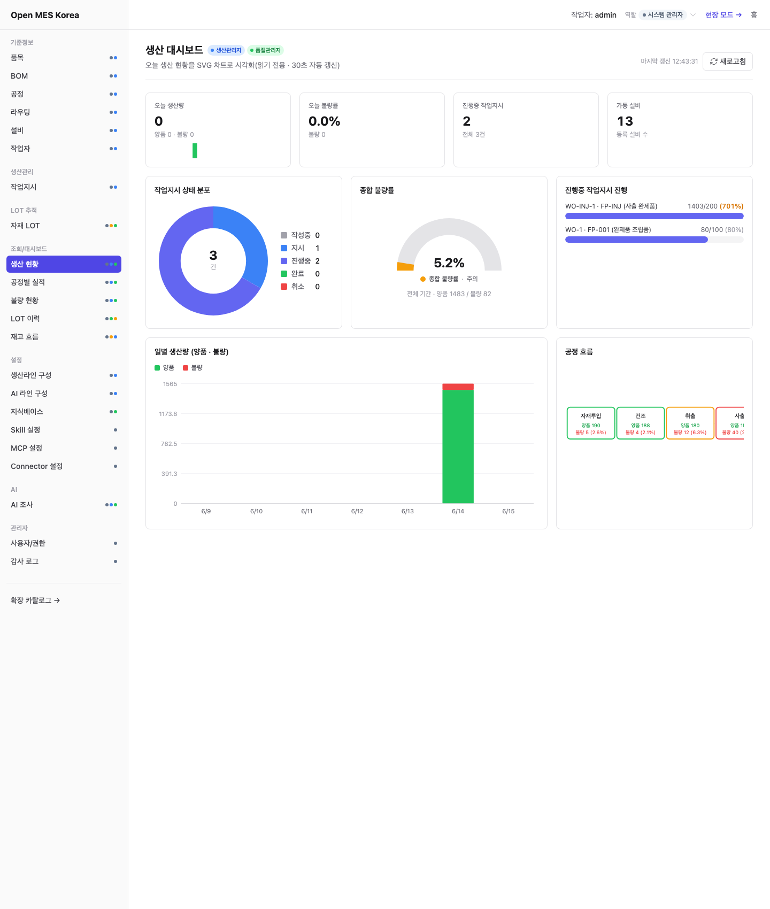
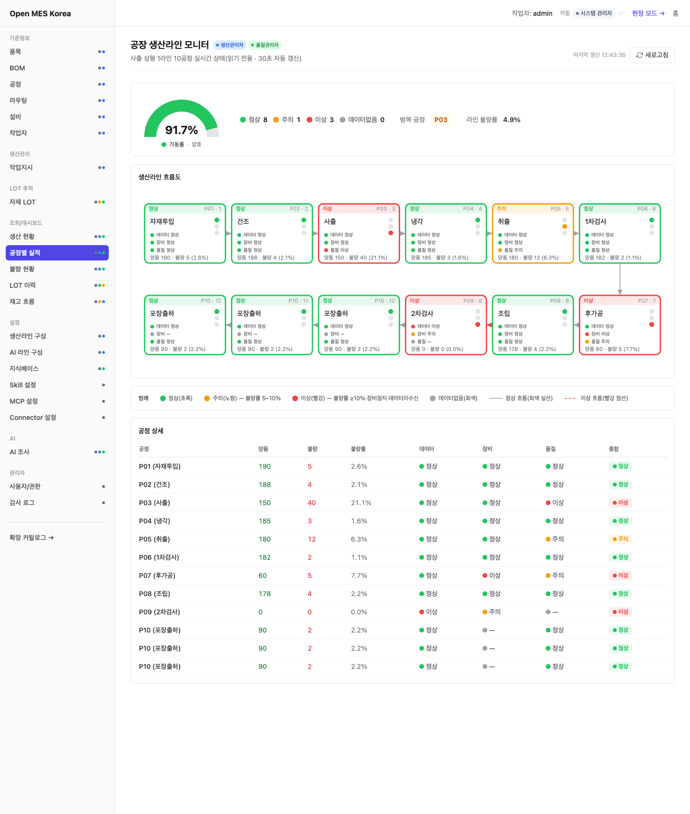
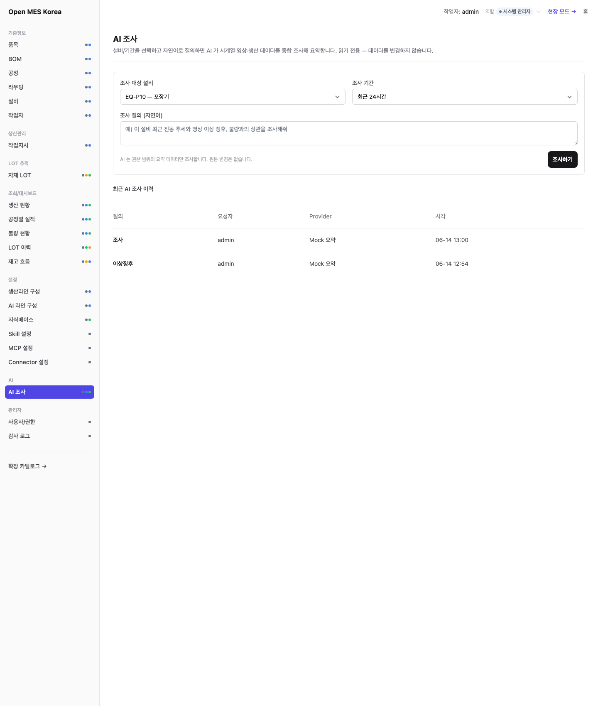

<div align="center">

# Open MES Korea

**제조 현장을 위한 작고 단단한 오픈소스 MES**

한국 제조 현장의 실제 업무 흐름에서 출발해
다양한 국가, 언어, 업종으로 확장 가능한 제조 실행 시스템을 만듭니다.

[English](README.en.md) · [日本語](README.ja.md) · [简体中文](README.zh-CN.md)

[공식 웹사이트](https://openmeskorea.org/) ·
[마켓플레이스](https://openmeskorea.org/#marketplace) ·
[도입 가이드](docs/adoption/README.md) ·
[비전](docs/vision.md) · [MVP](docs/mvp-scope.md) ·
[아키텍처](docs/system-architecture.md) · [로드맵](docs/roadmap.md) ·
[기여하기](CONTRIBUTING.md)

</div>

[](https://github.com/baryonlabs/open-mes-korea/actions/workflows/pages.yml)
[](https://github.com/baryonlabs/open-mes-korea/issues)
[](https://github.com/baryonlabs/open-mes-korea/discussions)

> [!IMPORTANT]
> Open MES Korea는 현재 설계 및 초기 구현 단계입니다. 운영 환경에 바로
> 설치할 수 있는 완성 제품이 아니며, 문서와 API는 구현 과정에서 변경될
> 수 있습니다.


## 화면 미리보기

### 생산 대시보드 — 순수 SVG 실시간 시각화

작업지시 상태 도넛, 종합 불량률 게이지, 일별 생산량 스택 막대, 공정 흐름 다이어그램을 외부 차트 라이브러리 없이 SVG로 렌더(30초 자동 갱신).



### 공장 생산라인 모니터 — 10공정 3축 신호등

데이터 처리·장비·품질 3축을 종합한 신호등(정상/주의/이상)으로 생산라인 전체를 한눈에 본다. 라인 구성은 설정 페이지에서 편집할 수 있다.



### AI 종합 조사 — 시계열·미디어·생산을 Claude가 조사

설비 시계열(TimescaleDB)·영상 미디어(MinIO)·생산 실적·OKF 지식 문서를 단일 컨텍스트로 종합 조사한다(Level 1 읽기 전용, 인용 근거 표시).



## 왜 Open MES Korea인가

제조 현장의 데이터는 작업지시, 종이 작업일보, 엑셀, 바코드, 설비와
ERP에 흩어져 있습니다. 기존 시스템이 있어도 공정 진행, 불량 원인과
자재·제품 LOT의 연결 관계를 즉시 확인하기 어려운 공장이 많습니다.

Open MES Korea는 ERP 전체를 다시 만드는 대신 다음 영역에 집중합니다.

```text
현장 실행
  + LOT 추적
  + 제조 데이터 수집·분석
  + 통제 가능한 AI
```

한국 제조 현장의 용어, 작업 방식과 도입 조건을 현실적인 출발점으로
삼습니다. 그러나 특정 언어와 국가에 묶이지 않도록 UI, 문서, 업무 용어와
현장별 규칙을 확장 가능한 구조로 설계합니다.

## 데이터 수집의 골든타임

제조 AI의 첫 단계는 모델이나 분석 벤더를 고르는 일이 아니라, 지금
발생하는 현장 데이터를 잃지 않고 수집하는 일입니다.

벤더 비교와 솔루션 선정에 수개월을 보내는 동안 과거의 생산조건, 불량,
설비 상태와 작업 이력은 다시 만들 수 없습니다. Open MES Korea는 완성된
AI 계획이 없어도 작업자 입력, 바코드, CSV와 표준 수집 API로 데이터를
먼저 축적할 수 있게 합니다.

```text
지금 데이터 수집
→ 이력과 품질 확보
→ 병목과 활용 가능성 분석
→ 적합한 AI 모듈·벤더 선택
→ 작은 PoC로 효과 검증
```

특정 분석 제품에 데이터를 가두지 않고 PostgreSQL, CSV와 API를 통해
이식 가능한 형태로 보존합니다. 이를 통해 AI 도입 시점에 데이터 수집부터
다시 시작하지 않고, 실제 데이터로 벤더와 모델을 비교할 수 있습니다.

## 설계 목표

- **작은 코어:** 모든 기능을 내장하지 않고 공통 생산 흐름만 단단하게 유지
- **다국어:** 한국어를 기본으로 여러 언어와 지역별 업무 용어 지원
- **확장 가능:** ERP, 설비, 업종별 규칙과 분석 기능을 독립적으로 연결
- **안정성:** 감사 로그, 중복 방지, 정정 이력과 장애 복구를 기본으로 설계
- **견고성:** 생산 데이터의 무결성과 LOT genealogy를 명시적으로 보존
- **빠른 응답:** 현장 입력과 조회에 불필요한 복잡성을 넣지 않는 구조
- **현장 우선:** 태블릿, 바코드와 짧은 입력 흐름을 우선
- **안전한 AI:** 읽기, 제안, 승인과 실행 권한을 분리

## 설치형 데이터 주권

Open MES Korea는 특정 SaaS 클라우드에 생산 데이터를 의무적으로 보내는
서비스가 아니라, 공장 서버나 사설 클라우드에 직접 설치할 수 있는
오픈소스 소프트웨어를 지향합니다.

- MES와 데이터베이스를 공장 내부망에서 운영 가능
- 생산실적, LOT, 품질과 설비 데이터를 운영자가 선택한 저장소에 보관
- 인터넷이 제한된 환경과 분리된 OT 네트워크를 고려
- 외부 AI, 메일, 분석, ERP 연동은 명시적으로 설정할 때만 활성화
- 외부 연동별 전송 데이터, 권한과 감사 이력을 운영자가 통제
- PLC command write는 기본 비활성화하고 안전 검토 후 제한적으로 허용

따라서 기본 설치만으로 외부 서비스에 생산 데이터를 전송하거나 설비를
제어하지 않습니다. 다만 오픈소스·온프레미스라는 사실만으로 보안이
자동 보장되는 것은 아닙니다. 실제 안전성은 방화벽, 계정 권한, TLS,
비밀정보 관리, 백업, 패치와 설치한 확장 모듈의 설정에 따라 달라집니다.

## 핵심 흐름


첫 번째 목표는 이 흐름을 실제 제조 현장에서 사용할 수 있는 수준으로
연결하는 것입니다.

## 핵심과 확장

### Core

| 영역 | 범위 |
|---|---|
| 기준정보 | 품목, BOM, 공정, 라우팅, 작업자, 설비 |
| 생산 실행 | 작업지시, 작업 시작·중지·완료, 생산실적 |
| 품질 | 불량수량, 불량유형, 공정별 품질 이력 |
| 추적성 | 자재 투입, 제품 LOT, LOT genealogy |
| 데이터 | 수동 입력, 바코드, CSV, HTTP ingestion |
| 분석 | 생산량, 불량률, 공정시간, 기간·품목·공정별 조회 |
| 운영 | 사용자, 권한, 감사 로그, event outbox |
| 연동 경계 | REST API, webhook와 표준 제조 이벤트 |

### Extensions

- ERP, WMS, QMS와 외부 시스템 연동
- MQTT, OPC UA, Modbus, Serial과 PLC connector
- Phoenix Broadway 기반 고처리량 이벤트 수집
- TimescaleDB 또는 ClickHouse 기반 대량 telemetry 분석
- OEE, 고급 계획, 예측 분석과 업종별 대시보드
- 바코드·라벨 템플릿과 현장별 업무 규칙
- AI 조회, 제안과 승인 기반 액션

특정 공장만 필요한 기능은 코어에 계속 추가하지 않고 명시적인 확장
지점으로 연결합니다.

## 제조 AI 확장 모듈

예지보전뿐 아니라 제조 공정 전체에 다음 AI 모듈을 단계적으로 연결할 수
있도록 설계합니다.

| 공정 영역 | 확장 모듈 | 주요 기능 |
|---|---|---|
| 품질 | 비전 검사 | 외관 불량, 치수·조립, X-ray/CT 결함 후보 탐지 |
| 계측·설계 | 가상 계측·시운전 | 센서 기반 품질 예측, 디지털 트윈과 라인 검증 |
| 생산 | 공정 최적화 | 공정 변수, 수율, 에너지 사용 최적 조건 제안 |
| 물류 | 자율 물류 | AMR/AGV 경로 최적화, 비전 기반 부품 피킹 연동 |
| 운영 | 예측·스케줄링 | 수요·재고 예측, APS 작업 우선순위 재계산 |
| 설비 | 예지보전 | 이상 징후, 고장 가능성, 점검 시점 후보 제안 |
| 안전 | 작업자 안전 | 보호구, 위험구역과 위험 행동 감지 후보 |
| 지식 | 제조 LLM | 매뉴얼·작업표준 검색, 오류 대응과 작업 보조 |

이 기능들은 기본 MES 코어에 모두 내장하지 않습니다. 데이터 품질, 현장
위험도와 ROI를 검증한 뒤 독립 모듈로 도입합니다. 특히 설비 제어, 품질
판정과 작업자 안전 경보는 AI가 단독으로 확정하지 않으며 승인 정책,
fail-safe, 현장 안전 검증과 감사 로그를 요구합니다.

## 데이터 수집과 분석

별도 분석 플랫폼을 먼저 도입하지 않아도 공장이 자체 데이터를 축적하고
기본 분석을 시작할 수 있는 도구를 제공합니다.

```text
작업자 / 바코드 / CSV / Edge Connector
                    │
                    ▼
          수집 · 검증 · 중복 방지
                    │
          ┌─────────┴─────────┐
          ▼                   ▼
   MES 업무 데이터       설비 Telemetry
   PostgreSQL             확장 저장소
          │                   │
          └─────────┬─────────┘
                    ▼
       조회 · 집계 · 분석 · AI Context
```

기본 범위:

- 작업자 입력, 바코드, CSV와 인증된 HTTP API
- 수집 오류, 중복, 누락과 시간 역전 검증
- 작업지시, 공정, 불량과 LOT 데이터 구조화
- 생산량, 불량률과 공정 소요시간 집계
- CSV export와 외부 분석용 API

고빈도 설비 데이터에는 Broadway를 수집 처리 계층으로 사용할 수 있습니다.
Broadway 자체를 분석 엔진으로 사용하지 않고, 검증·배압·배치·재시도와
실패 격리를 담당하게 합니다.

## 아키텍처

```text
Browser / Tablet
       │
       ▼
   Web / API
       │
       ├── MES Core
       ├── Background Jobs
       ├── Audit Log
       └── Event Outbox
              │
              ▼
          PostgreSQL

PLC / Sensor / Equipment
       │
       ▼
 Edge Connector ── HTTP / MQTT ── Ingestion
                                      │
                         Broadway Extension (optional)
                                      │
                         Telemetry Store (optional)
```

설비 데이터는 생산실적으로 바로 확정하지 않습니다. 먼저 후보 이벤트로
저장하고 작업지시, 공정, 작업자와 LOT의 관계를 검증한 뒤 반영합니다.

자세한 내용:

- [시스템 아키텍처](docs/system-architecture.md)
- [도메인 모델](docs/domain-model.md)
- [IoT 연결 전략](docs/iot-connectivity-open-source-strategy.md)
- [AI Native Architecture](docs/ai-native-architecture.md)

## AI 원칙

AI는 생산 데이터를 임의로 변경하는 운영자가 아닙니다.

| 단계 | 허용 범위 |
|---|---|
| Read | 권한이 적용된 생산 현황과 LOT 이력 조회 |
| Suggest | 이상 징후, 불량 패턴과 확인 항목 제안 |
| Approve | 권한 있는 사용자가 제안을 검토하고 승인 |
| Execute | 승인된 명시적 액션만 실행하고 감사 로그 기록 |

AI는 데이터베이스를 직접 조회하지 않고 AI Context API를 사용합니다.
생산실적, LOT 소비와 불량 기록은 AI가 직접 삭제할 수 없습니다.

## 프로젝트 상태

| 영역 | 상태 |
|---|---|
| 비전과 MVP 범위 | 문서화 완료 |
| 도메인 모델 | 초안 완료 |
| 시스템 및 AI 아키텍처 | 초안 완료 |
| 제조사 도입 가이드 | 초안 완료 |
| 애플리케이션 스캐폴딩 | 진행 중 |
| MES Core | 초기 구현 |
| LOT 추적 | 계획 |
| 데이터 수집·분석 | 계획 |
| 다국어 UI | 계획 |
| 운영 릴리스 | 미출시 |

현재 상태는 [로드맵](docs/roadmap.md)에서 관리합니다.

## 시작하기

현재는 실행 가능한 공식 릴리스가 없습니다. 프로젝트를 검토하려면 다음
문서를 순서대로 읽어 주세요.

1. [프로젝트 비전](docs/vision.md)
2. [MVP 범위](docs/mvp-scope.md)
3. [도메인 모델](docs/domain-model.md)
4. [시스템 아키텍처](docs/system-architecture.md)
5. [기여 가이드](CONTRIBUTING.md)

설치 명령과 Docker Compose는 첫 실행 가능한 스캐폴딩이 검증된 뒤 이
섹션에 추가합니다.

## 도입 검토

제조사는 기능 목록보다 현장 준비 상태를 먼저 확인해야 합니다.

- [도입 적합성 체크리스트](docs/adoption/fit-checklist.md)
- [현장 업무 조사표](docs/adoption/factory-discovery-questionnaire.md)
- [데이터 준비 체크리스트](docs/adoption/data-readiness-checklist.md)
- [IoT/설비 연결 점검표](docs/adoption/iot-connectivity-checklist.md)
- [도입 의사결정 기준](docs/adoption/adoption-decision-guide.md)
- [도입 리스크와 대응](docs/adoption/risks-and-mitigations.md)

한 제품군, 한 생산라인과 대표 LOT 흐름으로 시작하는 PoC를 권장합니다.

LLM과 함께 도입 준비도를 점검하려면 공개 사이트의
[기술도입 검증 프롬프트](https://openmeskorea.org/#adoption-prompt)를
사용할 수 있습니다. 프로젝트를 LLM이 이해할 수 있도록
[`llms.txt`](https://openmeskorea.org/llms.txt)도 제공합니다.

## 로드맵

- [x] Phase 0: 비전, 범위와 아키텍처
- [ ] Phase 1: MES Core
- [ ] Phase 2: LOT Traceability
- [ ] Phase 3: Shop Floor UX
- [ ] Phase 4: Data Collection & Basic Analytics
- [ ] Phase 5: AI Read-only & Decision Support
- [ ] Phase 6: Integrations & Extensions

범위와 순서는 실제 구현 및 현장 검증 결과에 따라 조정됩니다.

## 기여하기

현재 가장 필요한 참여:

- 제조 현장의 용어와 예외 흐름 검토
- Elixir/Phoenix, PostgreSQL 기반 핵심 기능 구현
- 작업자용 태블릿 UX
- LOT, 품질과 설비 연동 경험 공유
- 영어, 일본어, 중국어 및 기타 언어 번역
- 테스트, 보안, 성능과 장애 복구 검증

기여 전 [CONTRIBUTING.md](CONTRIBUTING.md)를 확인해 주세요. 큰 기능은
코드를 작성하기 전에 코어에 포함할지 확장으로 분리할지 먼저 논의합니다.

## 비목표

초기 단계에서는 다음을 목표로 하지 않습니다.

- ERP의 회계, 인사, 구매와 영업 전체 기능 대체
- 모든 업종과 PLC 드라이버를 코어에 내장
- 첫 버전부터 고급 APS와 완전 자동화 제공
- AI가 승인 없이 생산 데이터를 변경
- 검증되지 않은 기능을 운영 가능하다고 홍보

## 문서

| 문서 | 설명 |
|---|---|
| [Vision](docs/vision.md) | 프로젝트 원칙과 비목표 |
| [MVP Scope](docs/mvp-scope.md) | 첫 제품 범위 |
| [Domain Model](docs/domain-model.md) | 핵심 엔티티와 상태 |
| [System Architecture](docs/system-architecture.md) | 애플리케이션 구조 |
| [AI Architecture](docs/ai-native-architecture.md) | AI 권한과 승인 경계 |
| [Market Research](docs/market-research.md) | 시장과 오픈소스 분석 |
| [IoT Strategy](docs/iot-connectivity-open-source-strategy.md) | 설비 연결 전략 |
| [Adoption Guide](docs/adoption/README.md) | 제조사 도입 검토 |
| [Search & Discovery](docs/search-discovery-guide.md) | 검색엔진 등록과 저장소 발견성 운영 |
| [Domain Strategy](docs/domain-strategy.md) | 공식 도메인 선택과 연결 기준 |

## 라이선스

라이선스는 아직 확정되지 않았습니다. MIT를 우선 후보로 검토하고 있으며,
공식 공개 배포 전 `LICENSE` 파일과 저작권 표기를 확정합니다.

---

<div align="center">

**Start small. Trace everything. Extend deliberately.**

</div>
